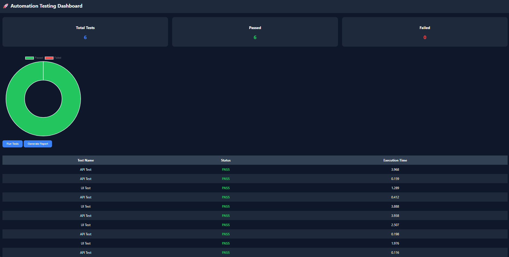
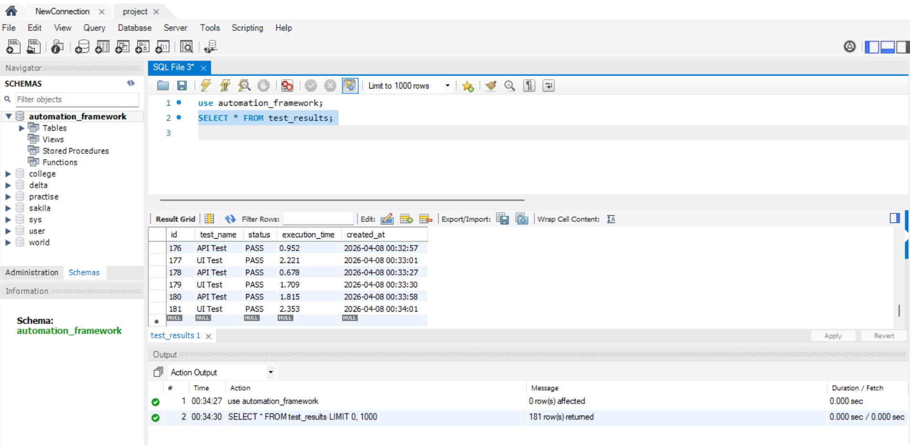
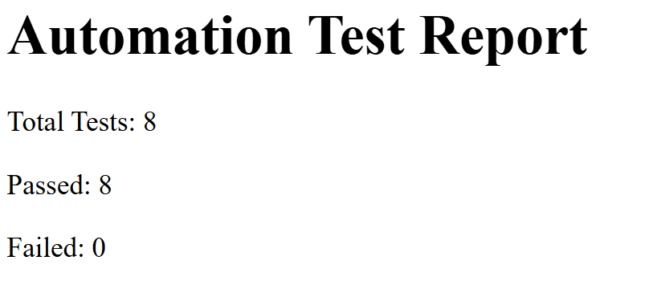

# 🚀 Automation Testing Framework

<p align="center">
  
  
  
  
  
</p>

---

## 📌 Overview

A **full-stack Automation Testing Framework** built using Spring Boot that integrates **UI Testing (Selenium)** and **API Testing (REST-Assured)** with **real-time analytics, reporting, and dashboard visualization**.

This project simulates a **mini enterprise testing tool** used in CI/CD pipelines.

---

## ✨ Key Features

✅ UI Automation using Selenium WebDriver
✅ API Testing using REST-Assured
✅ Parallel Test Execution (ExecutorService)
✅ Scheduled Test Execution (Spring Scheduler)
✅ JDBC Integration with MySQL
✅ HTML & CSV Report Generation
✅ Logging & Screenshot Capture on Failure
✅ Analytics APIs (Pass/Fail Metrics)
✅ Real-time Dashboard (Thymeleaf + Chart.js)

---

## 🏗️ Architecture

```text
Controller → Service → Executor → Test Runners → Analytics → Database → Reports
```

---

## 📸 Screenshots

### 📊 Dashboard



### 🗄️ Database (MySQL)



### 📄 Report Output



---

## 🛠️ Tech Stack

| Technology   | Purpose           |
| ------------ | ----------------- |
| Java         | Core Programming  |
| Spring Boot  | Backend Framework |
| Selenium     | UI Testing        |
| REST-Assured | API Testing       |
| MySQL        | Database          |
| JDBC         | DB Integration    |
| Thymeleaf    | Dashboard UI      |
| Chart.js     | Visualization     |

---

## ⚙️ Installation & Setup

### 1️⃣ Clone Repository

```bash
git clone https://github.com/YOUR_USERNAME/automation-testing-framework.git
```

### 2️⃣ Open in IntelliJ

### 3️⃣ Configure Database

Update `application.properties`:

```properties
spring.datasource.url=jdbc:mysql://localhost:3306/automation_framework
spring.datasource.username=root
spring.datasource.password=your_password
```

---

### 4️⃣ Run Application

```bash
Run DemoApplication.java
```

---

## ▶️ Usage

### 🔹 Run Tests

```bash
http://localhost:8080/tests/integrate
```

### 🔹 View Dashboard

```bash
http://localhost:8080/dashboard
```

### 🔹 Generate Reports

```bash
http://localhost:8080/reports/generate
```

### 🔹 View Analytics

```bash
http://localhost:8080/analytics/trends
```

---

## 📊 Sample Test Cases

* UI Test → Google Homepage Validation
* API Test → JSONPlaceholder API

---

## 🔮 Future Enhancements

* Dynamic user-defined test execution
* CI/CD Integration (GitHub Actions / Jenkins)
* Advanced analytics & filtering
* Scalable parallel execution

---

## 👨‍💻 Author

**Ayush Tripathi**

---

## ⭐ Support

If you like this project, give it a ⭐ on GitHub!
